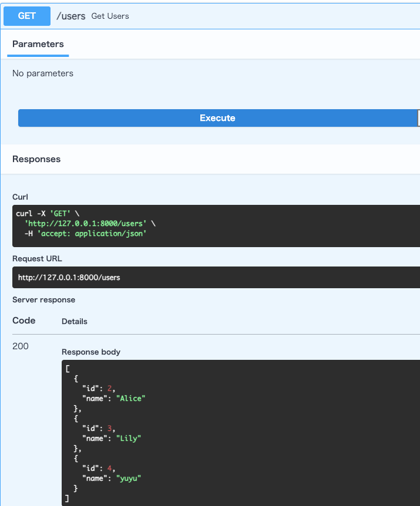
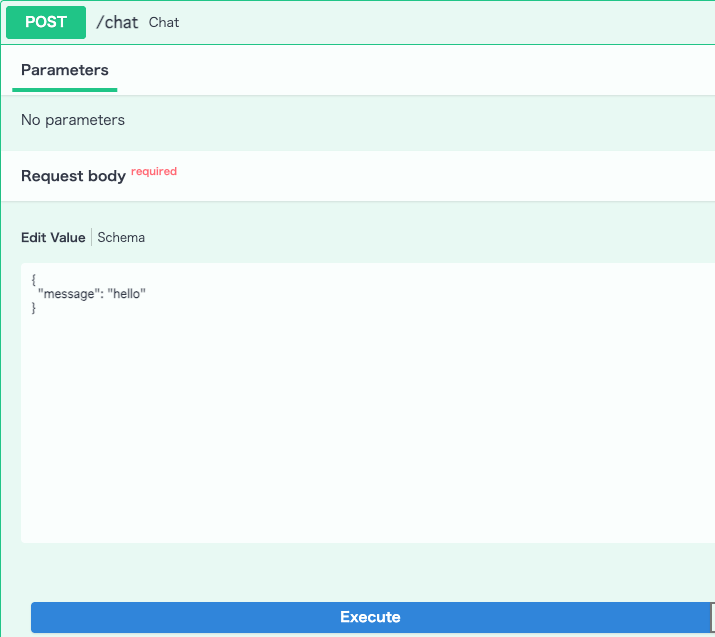
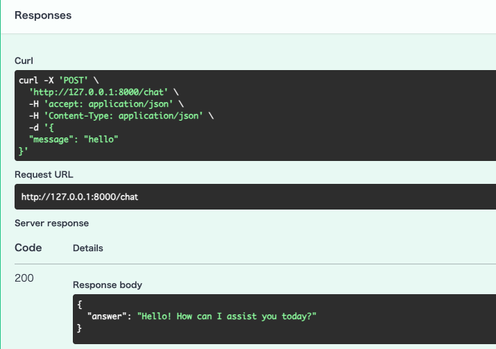

# AI Chat Backend

## Overview

Built an AI chat backend using FastAPI and OpenAI API with layered architecture and SQLite persistence.


## Features

- User CRUD
- AI Chat
- Chat History
- Chat Summary
- Chat Statistics
- SQLite Persistence
- OpenAI Integration
- Unit Testing with pytest


## Tech Stack

- Python 3.9
- FastAPI
- SQLite
- OpenAI API
- Pydantic
- pytest
- unittest.mock


## Setup

Install dependencies:

```bash
pip install -r requirements.txt
```

Run the server:

```bash
uvicorn main:app --reload
```


## Project Structure

```text
.
├── routers
├── services
├── repositories
├── models
├── tests
├── database.py
├── config.py
└── main.py
```


## Architecture

```text
Client
   │
   ▼
Router
   │
   ▼
Service
   │
   ▼
Repository
   │
   ▼
SQLite
```

The project follows a layered architecture (Router → Service → Repository) to separate responsibilities and improve maintainability.


## API Endpoints

| Method | Endpoint | Description |
|---------|----------|-------------|
| GET | /users | Get all users |
| GET | /users/{id} | Get user by id |
| POST | /users | Create user |
| PUT | /users/{id} | Update user |
| DELETE | /users/{id} | Delete user |
| POST | /chat | Generate AI response |
| GET | /chat/history | Get chat history |
| DELETE | /chat/history | Delete chat history |
| POST | /chat/summary | Generate chat summary |
| GET | /chat/stats | Get chat statistics |


## Screenshots

### User API



### AI Chat API

Send a message to the OpenAI-powered chat endpoint.

**Request**



**Response**




## Testing

Unit tests were implemented using **pytest**.

Current test coverage includes:

- Message building logic
- AI response generation
- Exception handling
- Mocking OpenAI API calls with `unittest.mock`

Run tests:

```bash
python -m pytest tests
```


## Future Improvements

- JWT Authentication
- Global Exception Handler
- Logging
- SQLAlchemy
- PostgreSQL
- Docker
- CI/CD Pipeline


## What I Learned

- Designed a layered architecture using Router, Service, and Repository.
- Built RESTful APIs with FastAPI.
- Integrated OpenAI API into a backend service.
- Implemented SQLite persistence.
- Used Pydantic for request and response validation.
- Wrote unit tests with pytest.
- Mocked external API calls using unittest.mock.
